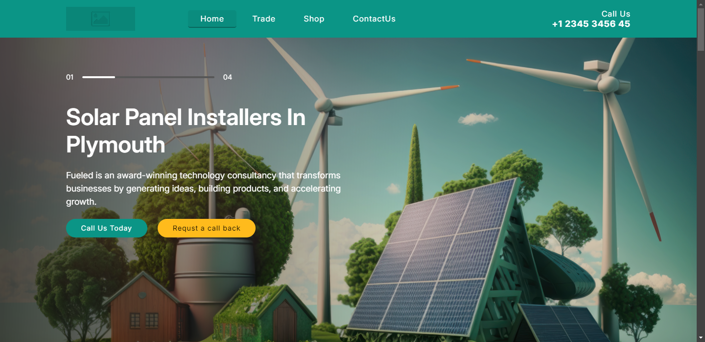

# Solar Website

This is a responsive website for a solar panel installation company. The website provides information about the company's services, products, and values. It also includes a contact section and a subscription form for the latest news.

## Table of Contents

- [Solar Website](#solar-website)
  - [Table of Contents](#table-of-contents)
  - [Features](#features)
  - [Technologies Used](#technologies-used)
  - [Usage](#usage)

## Features

- Responsive design for various screen sizes
- Informative sections about services, products, and company values
- Contact section with phone number and call-to-action buttons
- Subscription form for the latest news
- Testimonials from satisfied customers

## Technologies Used

- HTML5
- CSS3
- JavaScript
- Font Awesome for icons

## Usage

- Navigate through the website to learn more about the company's services and products.
- Use the contact section to get in touch with the company.
- Subscribe to the newsletter for the latest updates.
